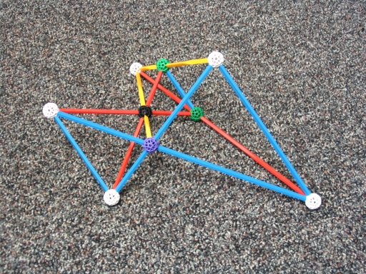

**Introduction**

This page starts with Desargues's theorem:

>If two triangles are perspective from a point, 
then they are perspective from a line.

One obtains Desargues's configuration when one draws the theorem.  It is a geometrical configuration with ten lines and ten points arranged in such a way that three points lie on every line and three lines lie on every point.  Here is one way to draw Desargues's configuration:

<figure>
<svg
  width="100mm"
  height="100mm"
  viewBox="95 95 605 505"
  xmlns="http://www.w3.org/2000/svg"
  stroke="black"
  fill="black">
  <polygon points="300,100 300,400 200,200" style="fill:rgb(255,191,191);stroke:rgb(255,0,0);stroke-width:2" />
  <polygon points="500,300 400,400 400,300" style="fill:rgb(191,191,255);stroke:rgb(0,0,255);stroke-width:2;opacity=0.01" />
  <line x1="300" y1="100" x2="300" y2="500" style="stroke:rgb(255,0,0);stroke-width:2" />
  <line x1="100" y1="300" x2="500" y2="300" style="stroke:rgb(0,0,255);stroke-width:2" />
  <line x1="200" y1="200" x2="600" y2="400" style="stroke:rgb(0,255,0);stroke-width:2" />
  <line x1="200" y1="200" x2="400" y2="600" style="stroke:rgb(255,0,0);stroke-width:2" />
  <line x1="300" y1="100" x2="600" y2="400" style="stroke:rgb(0,255,0);stroke-width:2" />
  <line x1="100" y1="300" x2="400" y2="600" style="stroke:rgb(0,0,0);stroke-width:2" />
  <line x1="400" y1="300" x2="400" y2="600" style="stroke:rgb(0,0,255);stroke-width:2" />
  <line x1="300" y1="400" x2="600" y2="400" style="stroke:rgb(0,255,0);stroke-width:2" />
  <line x1="300" y1="100" x2="100" y2="300" style="stroke:rgb(255,0,0);stroke-width:2" />
  <line x1="500" y1="300" x2="300" y2="500" style="stroke:rgb(0,0,255);stroke-width:2" />
  <circle cx="400" cy="400" r="2" />
  <circle cx="600" cy="400" r="2" />
  <circle cx="400" cy="600" r="2" />
  <circle cx="300" cy="500" r="2" />
  <circle cx="500" cy="300" r="2" />
  <circle cx="300" cy="400" r="2" />
  <circle cx="400" cy="300" r="2" />
  <circle cx="200" cy="200" r="2" />
  <circle cx="100" cy="300" r="2" />
  <circle cx="300" cy="100" r="2" />
</svg>
    <figcaption>Desargues's Configuration.</figcaption>
</figure>

The two triangles in perspective from a point are colored blue and red.  In particular, notice that (i) the three green lines formed by joining vertices from the two triangles are concurrent, and (ii) the points formed by the intersections of pairs of the sides of the triangles all lie on the black line.  Due to (i), we say the two triangles are *perspective from a point* and, due to (ii), we say that the triangles are *perspective from a line*.

**Zometool**

It is a remarkable fact that one may model Desargues's configuration in Zometool:

<figure>
    
    <figcaption>Zometool Model of Desargues's Configuration.</figcaption>
</figure>

In this model, nine of the points are represented by connectors, three lines are represented by a single strut each, and seven lines are each represented by a pair of collinear struts.  Thus, this model uses a total of 17 struts. The lines represented by a single strut are mutually parallel, meeting at a point in the "projective plane at infinity".  (We may identify the set of zones in 3 dimensional Euclidean with the real projective plane.) Moreover, by what seems to be a distinctly Zomic phenomenon, the three structs which represent lines that are concurrent at infinity obey the ratio [1:&beta;:1+&beta;], where &beta; the Golden Ratio.  Also, due to these three parallel lines, this model requires precisely 8 zones.

**A Conjecture.**

It is another remarkable fact that one may build at least a dozen variants of this configuration in Zometool.  After building a bunch of these, one notices that there appear to be two different "species" that one may build.   Thus, in the photos below, one sees that one model has a black connector with 6 struts emanating from it, whereas the other model has no such connector.

It seems extremely difficult to make a model of Desargues's configuration for which all 10 points are confined to finite space.  That is, it appears likely that every Zome model of the Desargues configuration has a triple of mutually parallel lines and thus a point at infinity.  Such an "ideal" model should have the following properties: (a) It should use exactly 10 connectors. (b) It should use exactly 20 struts. (c) Each line is represented by 2 struts with 3 connectors serving as endpoints.

<table BORDER=0 cellpadding=25>
   <tr>
      <td align="center">
        

      </td>
      <td align="center">
        

      </td>
   </tr>
</table>
<b>Figure 3.</b> Two Species of Zome Models of Desargues's Configuration. 

**References**

H. S. M. Coxeter *Introduction to Geometry.*
2nd ed., John Wiley & Sons, 1969.

Burkard Polster.  *A Geometrical Picture Book.*
Springer-Verlag Inc., New York, 1998.

